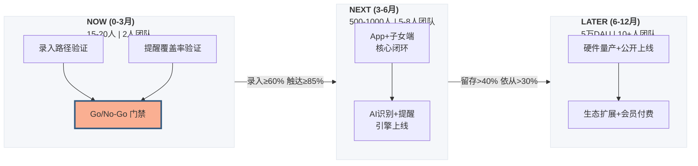
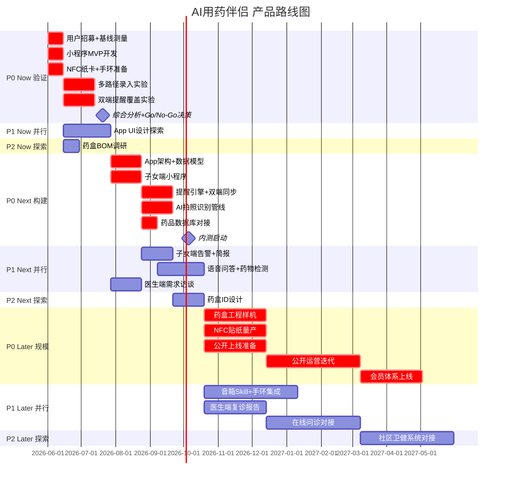
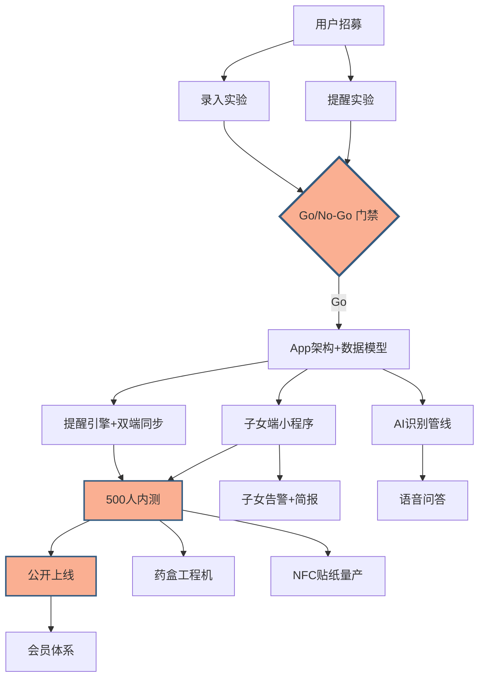

## 1. 产品愿景与核心价值主张

### 我们为什么做这件事

中国 55-75 岁人群中，超过 60% 长期服用 3 种以上药物。每年因漏服、错服、重复服药导致的急诊超过 200 万例。这不是"记性不好"的问题——是当一个人同时管理 5+ 种药、每种有不同的用法和时间窗时，仅靠人脑记忆本身就是一个不合理的期待。

现有解决方案——实体药盒、闹钟、子女电话提醒——都是在"补记忆"，而不是在"建系统"。

### 核心价值主张

> 让吃药这件事，从"靠记忆"变成"靠系统"。

**AI 用药伴侣 = 拍照识别 + 电子药箱 + 智能提醒 + 知识问答**，四合一降低用药风险。

### 为什么是现在

1. **视觉 AI 成熟**：OCR + 多模态模型已能准确识别复杂药品包装，包括中文说明书的细小字体
2. **语音交互普及**：大模型语音能力让不擅长打字的老年人可以直接"对话"提问
3. **银发经济窗口**：60后、70后开始大规模进入退休年龄，这一代人对智能手机的接受度远高于上一代
4. **政策推动**：国家正在推进"互联网+医疗健康"和居家养老服务体系建设

---

## 2. 用户旅程地图

目标用户：**王阿姨，62 岁，高血压+糖尿病，每天吃 5 种药，子女在外地工作**。

### 阶段一：认知与下载

| 维度 | 描述 |
|------|------|
| **触发场景** | 子女在家族群里转发，或社区医院张贴的二维码 |
| **用户动作** | 子女帮忙扫码下载，或社区医生推荐安装 |
| **用户情绪** | 😰 些许不安——"又要学一个新东西"；🙏 期待——"希望真的有用" |
| **痛点** | App 商店搜索困难，不知道叫什么名字；一个人住的老人没人帮忙下载 |

**关键洞察**：下载决策依赖子女或社区医生，拉新成本在"信任传递"而非"流量投放"。

### 阶段二：首次使用与 onboarding

| 维度 | 描述 |
|------|------|
| **触发场景** | 打开 App，面对注册和引导流程 |
| **用户动作** | 输入基本信息（年龄、基础疾病），首次拍照识别药品 |
| **用户情绪** | 😣 焦虑——"字太小看不清，操作太复杂"；🙂 惊喜——"拍个照就能认出来？" |
| **痛点** | 注册流程繁琐，手机号验证对老人不友好；字体和按钮太小；首次拍照不懂怎么对准药品 |

**关键洞察**：onboarding 体验决定留存。必须支持"子女远程代配置"——子女在自己手机上帮老人录入首轮药品，然后同步到老人手机。

### 阶段三：药品录入与电子药箱

| 维度 | 描述 |
|------|------|
| **触发场景** | 每次拿到新药，或定期整理药品 |
| **用户动作** | 拍照 → AI 识别 → 确认信息 → 加入电子药箱 |
| **用户情绪** | 😊 满足——"拍个照就自动填好了，真方便"；😟 担忧——"它识别得对不对啊？" |
| **痛点** | AI 可能识别错误（药品名、剂量、用法）；用户难以判断识别结果是否准确；药品包装更新后旧模型失效 |

**关键洞察**：识别准确率不仅仅是技术指标，更是信任指标。一次识别错误可能导致用户彻底放弃使用。

### 阶段四：日常服药提醒与打卡

| 维度 | 描述 |
|------|------|
| **触发场景** | 每天定时弹窗/语音提醒 |
| **用户动作** | 看到提醒 → 找到对应药品 → 服用 → 点击"已服用"确认 |
| **用户情绪** | 😌 安心——"有人提醒我，不会忘了"；😤 烦躁——"老响，烦不烦"；😨 恐慌——"我刚刚吃没吃过？" |
| **痛点** | 提醒频率过高造成骚扰；提醒时机不对（人在外面、手机不在身边）；确认操作太繁琐 |

**关键洞察**：提醒的设计是体验的核心杠杆——提醒太少不如不用，提醒太多用户会关掉通知权限，直接废掉核心功能。

### 阶段五：用药咨询与副作用管理

| 维度 | 描述 |
|------|------|
| **触发场景** | 身体出现不适，或需要了解"两种药能不能一起吃" |
| **用户动作** | 语音提问或打字查询 |
| **用户情绪** | 😰 焦虑——"吃了药不舒服是不是正常的？"；🤔 不确定——"AI 说的能信吗？" |
| **痛点** | 医疗信息的信任度——AI 答错了怎么办？紧急情况 AI 无法处理；缺少与真实医生对接的渠道 |

**关键洞察**：用药咨询是"高价值、高风险"功能。AI 必须明确自己的边界——"这个我不确定，建议咨询医生"比给出一个可能错误的答案更有价值。

### 阶段六：持续使用与习惯养成

| 维度 | 描述 |
|------|------|
| **触发场景** | 使用 1-3 个月后 |
| **用户动作** | 日常被动接收提醒，偶尔主动查询 |
| **用户情绪** | 😊 习惯——"已经是生活的一部分了"；😐 平淡——"还行吧，反正没出问题"；😞 流失——"换手机后就忘了装" |
| **痛点** | 缺少持续使用的激励（没有"用药打卡成就"）；产品价值在"不出事"时不可见——用户感受不到 AI 在背后帮了多少忙；换手机后数据迁移困难 |

**关键洞察**：长期留存靠的不是功能，而是"安全感"——让用户觉得"有这个 App 在，吃药这件事多了一重保障"。

---

## 3. 最需要验证的三个假设

### 假设一（最高优先级）：拍照识别行为假设

> **"55-75 岁老年人愿意并且能够用手机拍摄药品包装，作为日常用药录入的主要方式。"**

**为何最高优先级**：如果拍照录入这个输入行为本身不成立，整个产品的核心交互就崩塌了。这是产品的基础假设，不是优化假设。

**验证指标**：首次拍照成功率（用户能独立完成一次有效拍照的比例），目标 > 70%。

### 假设二：提醒行为改变假设

> **"定时提醒能显著改善老年人的用药依从性，且不会因过度提醒导致用户关闭通知权限。"**

**为何第二优先**：提醒是产品价值的直接体现。如果提醒不改变行为，产品就成了一个电子药盒目录，价值大打折扣。同时，"提醒疲劳"是最大风险——一旦被关通知，产品等于不存在。

**验证指标**：用药依从率提升 > 30%，通知权限保留率 > 80%（使用 4 周后）。

### 假设三：AI 健康建议信任假设

> **"老年人愿意接受 AI 提供的用药知识建议，并能在 AI 明确边界时保持合理的信任度。"**

**为何第三优先**：这个假设影响产品长期价值和差异化。但如果前两个假设不成立，这个假设的验证没有意义。

**验证指标**：知识问答功能的使用频率，用户对"建议咨询医生"类回复的接受度（不因此放弃使用）。

---

## 4. 多角色方案审查

以下从五个角色视角，带入真实家庭场景进行方案交叉审查。每一段审查以**模拟场景**驱动，而非抽象评价。

### 4.1 老人：张大爷，70 岁，独居，轻微手抖+老花眼，每天 6 种药

**场景 A —— 拍照录入**

张大爷打开 App 想录新药。他手抖，照片糊了，AI 说"请重新拍照"。他不知道是手抖、光线还是距离的问题。试了三次，他把手机放下了。

他有三种同厂药品包装几乎一样，25mg 和 50mg 的差别印在角落小字里 —— AI 识别为同一种，他没发现。

**更致命的是**：他大多数药是从社区医院拿的，药房把药拆出原包装，用小纸袋分装，手写"日三次 1片"。没有包装可拍，核心录入路径直接失效。

**场景 B —— 日常提醒**

张大爷手机在客厅充电，人在卧室午睡。提醒响了，没听到。醒来后通知栏里一排消息，他不知道哪个是刚才错过的。

**场景 C —— 用药咨询**

张大爷用四川话问："这个药吃了咋个脑壳昏呢？"AI 没反应。（方言适配缺失）

**审查发现**：

| 问题 | 严重程度 | 当前方案是否覆盖 |
|------|----------|-----------------|
| 手抖导致拍照模糊，AI 无指导性重试反馈 | 高 | 否——只说"请重试"，不说明原因 |
| 同厂不同剂量药品包装高度相似 | 高 | 否——仅靠视觉识别不足以区分 |
| **医院分装纸袋无包装可拍** | **致命** | **否——最常见场景完全失效** |
| 手机不在身边导致提醒不可达 | 高 | 否——纯手机方案覆盖<50% |
| 方言语音识别 | 中 | 否——仅假设普通话场景 |

### 4.2 子女：小张，35 岁，北京工作，父母在老家

**场景 A —— 异常告警**

小张发现妈妈的降压药打卡断了三天。是 App 出 bug 了？手机没电了？妈妈住院了？没人告诉她原因，她只能焦虑地打电话。

半夜收到推送"母亲可能错过了降压药"。小张打过去——妈妈只是在洗澡没带手机。三次虚惊之后，她关掉了 App 通知。

**子女需要的不是"吃了"的每日报告，而是"没吃"的精准告警。"没有消息就是好消息。"**

**场景 B —— 跨医生处方冲突**

妈妈同时看心内科和内分泌科，两个医生分别开了新药。小张担心有相互作用，但没人告诉她，App 也没检测。

**场景 C —— 多子女协作**

三个子女都想关注妈妈的用药。谁有权限修改药箱？大哥改了剂量，二姐需要收到通知吗？

**审查发现**：

| 问题 | 严重程度 | 当前方案是否覆盖 |
|------|----------|-----------------|
| 异常告警 vs. 每日平安报告的设计取向 | 高 | 否——原方案假设子女需要完整日志 |
| 假阳性告警（设备离线≠漏服）消耗信任 | 高 | 否——未区分"确定漏服"和"状态未知" |
| 跨医生处方的药物相互作用检测 | 中 | 否 |
| 多子女权限管理与操作同步 | 中 | 否 |
| 多老人并行管理（离异父母等） | 低 | 否 |

### 4.3 处方医生：张医生，三甲医院心内科，每天 80+ 病人

**场景 A —— 复诊决策**

病人血压控制不好。张医生不知道是药效不够，还是病人根本没按时吃。如果 App 能出"依从性+血压趋势"报告，他可以据此精准调药。

**场景 B —— AI 副作用信息的干扰**

AI 告诉病人"XX药可能引起头晕（发生率 0.1%）"。病人擅自停药，血压飙升。张医生最怕这种事——**AI 提供副作用信息时不标注发生率，病人无法评估真实风险，直接采取最"安全"的行动（停药），反而更危险。**

**场景 C —— 社区医生**

李医生管着 200+ 慢病老人，靠纸质档案。如果 App 能给她依从率排名，她能优先家访依从率最低的老人。

**审查发现**：

| 问题 | 严重程度 | 当前方案是否覆盖 |
|------|----------|-----------------|
| 用药依从性数据对调药的临床价值 | 中 | 否——原方案未设计"复诊报告"功能 |
| AI 副作用提醒缺失发生率标注 | 高 | 否——可能误导患者停药 |
| 药物相互作用检测需权威数据源 | 高 | 否——原方案未明确数据来源 |
| 医生不是直接用户，而是间接受益方 | — | 需调整产品定位 |

### 4.4 App 设计师：面对"五个功能 vs. 老人只能理解两个"的矛盾

**核心矛盾**：拍照、药箱、提醒、打卡、咨询 —— 五个功能模块。但为老人设计的信息架构，两个 Tab 就是认知上限。

**场景 A —— 今日视图**

一天 5 种药，每种有不同服用条件（空腹/饭后/睡前/必要时）。如果在同一屏展示所有状态（待服/已服/错过/跳过），信息密度远超老人处理能力。

**场景 B —— 颜色编码失效**

红绿色盲老人无法区分红色"没吃"和绿色"已吃"。必须颜色+图标+文字三重编码。

**场景 C —— 容错设计**

老人点错了，想撤销——但找不到撤销按钮。误触是老人的常态，不是边缘 case。滑动删除对手指不灵活的老人几乎不可执行。"加载中""网络错误"老人看不懂。

**场景 D —— 语音交互的边界**

在菜市场、公园、电视机前，语音识别率骤降。更关键的是隐私——老人在公共场合对着手机说"我今天吃没吃降压药"，旁边人都听到了。

**审查发现**：

| 问题 | 严重程度 | 当前方案是否覆盖 |
|------|----------|-----------------|
| 信息架构需要极简，功能复杂度与之矛盾 | 高 | 否——原方案按功能模块设计 |
| 状态编码需颜色+形状+文字三重确认 | 高 | 否 |
| 容错和撤销机制需作为核心交互设计 | 中 | 否——原方案视为边缘case |
| 语音交互的公共空间隐私泄露 | 中 | 否 |
| 触控目标最小尺寸、间距等无障碍标准 | 中 | 部分——提了大字体，未提具体标准 |

### 4.5 硬件场景设计：手机和药，根本不在一个房间

**核心发现：纯手机 App 在居家场景的提醒覆盖率 < 50%。**

**场景 A —— 居家物理分布**

药在床头柜。手机在客厅充电。老人在厨房做饭。提醒响了——家里三处空间，哪个能听到？

老人不是年轻人。年轻人手机 24 小时在手边。老人在家，手机放在固定位置，人不跟着手机走。

**场景 B —— 冷藏药品**

胰岛素需要冷藏 2-8°C，取出后回温 30 分钟才能注射。这个时间窗口的提醒逻辑跟"饭前半小时"不一样——需要两个提醒：①取药（注射前30分钟）②注射。

**场景 C —— 非标准剂型**

中药汤剂没包装。口服液剂量是"几毫升"。保健品瓶身标签跟处方药格式完全不同。**最致命的是医院分装纸袋——中国最常见的慢病用药场景，药房拆掉原包装，纸袋上只有手写的"日三次 1片"。**

**场景 D —— 可能的硬件协同**

- **NFC 贴纸**：药房分装时贴一枚 NFC 在纸袋上，App 靠近即读，绕开拍照。解决手抖、光线、包装变更、分装纸袋四个问题。
- **智能药盒**：物理分格，到时间对应格子亮灯+发声。不依赖手机，老人看到灯亮就知道吃哪格。
- **智能音箱**：用药提醒在主要活动区域（客厅/厨房）播报。
- **智能手环**：震动提醒，随身佩戴，覆盖率最高。

**审查发现**：

| 问题 | 严重程度 | 当前方案是否覆盖 |
|------|----------|-----------------|
| 手机居家场景提醒覆盖率 < 50% | **致命** | 否——纯App方案有结构性缺陷 |
| 医院分装纸袋无包装可识别 | **致命** | 否 |
| 冷藏药品的复温时间窗口提醒 | 中 | 否 |
| 中药/口服液/保健品等非标准剂型 | 中 | 否 |
| NFC/药盒/音箱/手环多端协同 | — | 未考虑，需纳入路线图 |

### 4.6 三个交叉致命盲区

**交叉一：医院分装药袋**（老人 × 医生 × 硬件）
中国慢病老人最常见的取药场景。原方案核心输入（拍照识别原包装）在此场景完全失效。

**交叉二：提醒不可达**（老人 × 硬件 × 设计师）
"App提醒响了 → 老人没听到 → 记录'未服用' → 子女收到告警 → 焦虑打电话 → 发现只是手机没电"——这个链条的根源是纯App方案的物理覆盖缺陷。

**交叉三：AI信任的"最后一厘米"**（老人 × 医生 × 设计师）
AI正确10次，老人觉得"还行"。错1次，永远不信任。错误成本不对称：漏服可能进急诊，而正确的价值是"一切如常"。必须把AI的"不确定"暴露为负责任的信号，而非隐藏。

---

## 5. 最需要验证的三个假设

多角色审查后，假设优先级如下：

### 假设一（最高优先级）：非原包装药品的录入行为假设

> **"面对医院分装纸袋、中药汤剂、口服液等非标准包装，老年用户能否通过替代路径（NFC靠近识别、语音描述、子女远程录入）成功将药品加入电子药箱？"**

**修订原因**：原假设一仅覆盖"拍照识别原包装"，但多角色审查发现，医院分装纸袋才是慢病老人最常见的取药形态。如果只验证拍照而忽视分装纸袋，MVP通过但产品仍无法服务最核心场景。

**验证指标**：非标准包装药品录入成功率（用户能通过任一替代路径完成录入的比例），目标 > 80%。

### 假设二：多端提醒覆盖率假设（新增）

> **"在居家场景下，手机+智能药盒（或音箱/手环）的多端提醒方案，能否将用药提醒触达率从 <50% 提升至 >90%？"**

**修订原因**：硬件场景审查揭示了纯 App 方案的结构性缺陷——手机与药品在物理空间上分离。这是产品能否实际运转的物理前提，非功能优化。

**验证指标**：居家全天的提醒实际触达率（老人确认感知到提醒的次数/提醒总次数），目标 > 90%。

### 假设三：提醒行为改变假设（原假设二，优先级下调）

> **"定时提醒能显著改善老年人的用药依从性，且不会因过度提醒导致用户关闭通知权限或产生提醒疲劳。"**

**验证指标不变**。

### 假设四：异常告警信任假设（新增，来自子女视角）

> **"子女对'异常告警'（确定漏服）和'状态未知'（设备离线）的区分设计有足够信任，不会因假阳性而关闭通知。"**

**验证指标**：子女通知权限保留率 > 80%（使用 4 周后），假阳性告警占比 < 20%。

> 注：原"AI 健康建议信任假设"降级为 Next 阶段验证项——在基本行为假设和硬件覆盖率假设验证通过之前，AI 问答的使用频率不足以支撑有效验证。

---

## 6. 最低成本验证方案（修订）

### 验证假设一（非标准包装录入）+ 假设二（多端提醒覆盖率）

**方案：纸袋 + 纸卡模拟双路径 MVP**

| 要素 | 具体做法 |
|------|----------|
| **载体** | 微信小程序（同原方案）+ **10张模拟NFC纸卡**（普通名片纸打印二维码，模拟NFC靠近识别的体验） |
| **路径一** | 拍照识别——给老人看有原包装的药，拍照录入（保留原验证） |
| **路径二** | 纸袋+纸卡——给老人医院分装纸袋，纸袋上贴有二维码贴纸，手机扫码即录入（模拟NFC） |
| **路径三** | 语音描述——"我有一盒白色的降压药，叫络活喜，每天早上一片"，后台人工录入 |
| **用户** | 在社区医院邀请 15 位 55-75 岁老人（比原方案多 5 位，覆盖路径二的样本） |
| **观察点** | 新增：①分装纸袋场景下用户的第一反应（是否会尝试拍照？还是直接放弃？）②贴纸扫码/NFC 的理解门槛③三种路径的偏好分布 |
| **提醒验证** | 给 5 位种子用户配一个廉价蓝牙手环（成本 <50 元/个），观察手机+手环双端提醒的实际触达率 |
| **成本** | 小程序开发 2-3 天 + 15 位用户访谈 + 5 个蓝牙手环 |
| **时间** | 2 周 |
| **成功标准** | ①≥ 60% 老人至少通过一种路径完成分装纸袋药品录入 ②手环+手机双端提醒触达率 > 85% |

---

## 7. 伦理与安全风险

### 风险一：AI 识别错误导致错误用药

| 维度 | 描述 |
|------|------|
| **严重程度** | ⛔ 极高——直接威胁生命健康 |
| **典型场景** | AI 将"A 药"误识别为外形相似的"B 药"；剂量识别错误（mg 看成 g）；同厂不同剂量的相似包装无法区分 |
| **设计规避** | ①**置信度门控**：低于阈值（如 95%）的识别结果，强制展示"请仔细核对"警告，不自动入库 ②**二次确认**：入库前要求用户或家属确认药品名和剂量 ③**包装多面验证**：引导用户拍摄药品正反面，AI 交叉验证 ④**剂量高亮对比**：若同一通用名存在多剂量规格，主动弹窗"该药品有 25mg 和 50mg 两种规格，请确认是哪种" ⑤**免责声明**：底部常驻"本产品为辅助工具，不构成医疗建议" |

### 风险二：隐私与数据安全

| 维度 | 描述 |
|------|------|
| **严重程度** | ⛔ 高——用药数据属于最敏感的医疗隐私 |
| **典型场景** | 用户用药记录被第三方获取，用于保险定价、广告推送甚至诈骗 |
| **设计规避** | ①**本地优先**：照片和药箱数据默认存储在设备端，不上传云端 ②**最小数据原则**：仅上传识别所需的必要字段，不存储原始照片 ③**明确的数据控制权**：用户可一键导出或删除所有数据 ④**合规前置**：从 Day 1 遵循《个人信息保护法》和《健康医疗大数据标准》 |

### 风险三：过度依赖 AI 延误就医

| 维度 | 描述 |
|------|------|
| **严重程度** | ⛔ 高——用户可能用 AI 问答替代看医生 |
| **典型场景** | 出现严重副作用症状，用户先问 AI 而非就医，延误治疗窗口 |
| **设计规避** | ①**红线关键词触发**：当用户提及胸痛、呼吸困难、意识模糊等急诊症状，立即弹出"请立即拨打 120" ②**每句 AI 回复附带边界声明**："我是 AI 助手，不能替代医生的专业判断" ③**就医引导**：对于非紧急但有风险的症状，主动建议预约医院 |

### 风险四：老年用户的技术排斥与数字鸿沟

| 维度 | 描述 |
|------|------|
| **严重程度** | 中——导致产品无法触达最需要的人 |
| **典型场景** | 用户觉得"太难用"直接放弃；不会打字导致部分功能用不了；手抖+老花眼导致基础操作困难 |
| **设计规避** | ①**语音优先**：所有输入操作支持语音，知识问答默认语音交互 ②**大字体、大按钮、高对比度**：按钮≥56dp，字号≥18sp，对比度≥7:1（WCAG AAA） ③**子女协作模式**：子女端可远程管理药品、查看依从记录 ④**线下触点**：在社区医院、药店提供扫码直达入口 |

### 风险五：AI 副作用信息不标注发生率导致患者擅自停药（新增）

| 维度 | 描述 |
|------|------|
| **严重程度** | ⛔ 高 —— 患者因不了解副作用发生概率而做出错误停药决策 |
| **典型场景** | AI 回答"XX药可能引起肝功能异常"，老人不知发生率仅 0.05%，因恐惧而自行停药，导致基础疾病恶化 |
| **设计规避** | ①副作用回答必须标注发生率（如"临床试验中约 0.05% 的患者出现"）②使用自然频率而非百分比（"10000人里约有5人"而非"0.05%"）③任何副作用提醒附带"请咨询医生后再决定是否停药，切勿自行停药"④医生端可见患者查询了哪些副作用，供复诊时主动沟通 |

### 风险六：多端数据同步下的隐私泄露

| 维度 | 描述 |
|------|------|
| **严重程度** | 中 —— 药盒/音箱/手环等硬件增加数据暴露面 |
| **典型场景** | 智能音箱在客厅播报"该吃降压药了"，来访客人听到；手环数据通过蓝牙传输被监听 |
| **设计规避** | ①音箱提醒不播报具体药名，只说"该吃药了"（隐私模式）②硬件间通信启用 BLE 加密③药盒等物理设备不带存储，仅作为提醒终端 |

---

## 8. 详细路线图

### 全局视图：三阶段推进节奏

### 总览：三阶段甘特图

---

### 阶段一：Now（第 1–12 周）—— 验证核心假设

**阶段目标**：用最低成本验证"分装纸袋录入"和"多端提醒覆盖"两个假设。不通过则及时止损。

**Go/No-Go 决策点**：第 12 周末，两项核心指标（录入成功率 ≥60%、双端提醒触达率 ≥85%）必须同时达标方可进入 Next。

#### 第 1–2 周：用户招募 + 基线测量 + 小程序开发

| 任务 | 优先级 | 工作量 | 依赖 | 说明 |
|------|--------|--------|------|------|
| 社区医院渠道对接，招募 15-20 位种子用户 | **P0** | 3 人日 | 无 | 跑 2-3 家社区医院/养老服务站，签知情同意书 |
| 种子用户基线用药行为测量（1 周日志+访谈） | **P0** | 5 人日 | 用户招募完成 | 记录当前漏服率、用药困惑、现有提醒方式，作为后续对比基线 |
| 微信小程序 MVP 开发（拍照+扫码+语音三路径前端） | **P0** | 5 人日 | 无 | **与用户招募并行**。仅前端壳+图片上传+二维码扫描+语音录制，后端人工处理 |
| Wizard of Oz 后台搭建（微信群接收照片/语音，人工识别回复） | **P0** | 2 人日 | 小程序开发 | 极简——微信群机器人或共享文档即可 |
| 模拟 NFC 纸卡制作（名片纸+二维码，模拟"靠近即识别"） | **P0** | 1 人日 | 无 | 打印 50 张，每张包含模拟药品信息 |
| 蓝牙手环采购与配对调试 | **P0** | 1 人日 | 无 | 5 个廉价手环（<50 元/个），与小程序提醒联动 |

> **并行提示**：用户招募、小程序开发、纸卡制作、手环采购四条线可同时启动，第 1 周即可并行推进。

#### 第 3–6 周：多路径录入实验

| 任务 | 优先级 | 工作量 | 依赖 | 说明 |
|------|--------|--------|------|------|
| 路径一实验：原包装拍照录入 | **P0** | 3 人日 | 小程序完成 | 每人 3 种药，观察拍照质量、重试次数、独立完成率 |
| 路径二实验：分装纸袋+二维码贴纸扫码录入 | **P0** | 3 人日 | 纸卡完成 | 模拟医院分装场景，观察用户是否会尝试扫码、是否理解贴纸含义 |
| 路径三实验：语音描述录入（"白色降压药，每天早上一片"） | **P1** | 2 人日 | 小程序完成 | 不是所有老人会用语音输入，需观察使用意愿 |
| 三种路径偏好数据汇总与分布分析 | **P0** | 2 人日 | 三个实验完成 | 输出录入成功率、路径偏好排序、失败原因分类 |

#### 第 7–10 周：双端提醒覆盖实验

| 任务 | 优先级 | 工作量 | 依赖 | 说明 |
|------|--------|--------|------|------|
| 手机端提醒触达率基线测量（仅手机通知，1 周） | **P0** | 2 人日 | 用户招募 | 验证纯 App 方案覆盖率是否真的 <50% |
| 手机+手环双端提醒触达率实验（2 周） | **P0** | 3 人日 | 手环调试完成 | 手环震动+手机通知同时触发，记录老人实际感知率 |
| 不同提醒时机（老人位于不同房间/外出/午睡）的触达差异分析 | **P1** | 2 人日 | 触达数据采集 | 为提醒时机设计积累场景数据 |
| 提醒频率与用户烦躁阈值测试 | **P1** | 2 人日 | 触达数据采集 | 一天几次提醒开始厌烦？哪个时间段最反感？ |

#### 第 11–12 周：综合分析与 Go/No-Go 决策

| 任务 | 优先级 | 工作量 | 依赖 | 说明 |
|------|--------|--------|------|------|
| 全部实验数据汇总，撰写验证报告 | **P0** | 3 人日 | 所有实验完成 | 含定量（录入成功率、触达率）和定性（访谈语录、观察笔记） |
| App UI 框架探索性设计（不写代码，纯设计稿） | **P1** | 3 人日 | 无 | **可与分析并行**。2-Tab 信息架构、今日视图布局、语音交互流程 |
| 智能药盒 BOM 成本初步调研 | **P2** | 1 人日 | 无 | 了解物理分格+LED+蜂鸣器+蓝牙模块的物料成本 |
| **Go/No-Go 决策会议** | **P0** | 0.5 人日 | 验证报告完成 | 两项 P0 指标均达标 → Go；任一未达标 → 调整方向或止损 |

> **阶段一并行策略**：用户招募与小程序开发并行（第 1-2 周）→ 录入实验与提醒实验之间有 1 周重叠可并行（第 9 周）→ App 设计探索可全程并行（第 5 周起随时启动）。

---

### 阶段二：Next（第 13–24 周）—— 核心闭环 + 子女端 MVP

**阶段目标**：用药提醒+打卡+电子药箱形成完整闭环，子女端异常告警上线。500-1000 人内测。

**进入前提**：阶段一 Go/No-Go 通过。

#### 第 13–16 周：App 基础架构 + 子女端骨架

| 任务 | 优先级 | 工作量 | 依赖 | 说明 |
|------|--------|--------|------|------|
| App 技术架构搭建（本地优先 local-first，离线可用） | **P0** | 8 人日 | Go决策 | 药品数据本地 SQLite，照片本地存储，仅必要字段云端同步 |
| 电子药箱数据模型与 CRUD | **P0** | 5 人日 | 架构搭建 | 药品信息、服用计划、提醒规则、打卡记录四张核心表 |
| 老人端 2-Tab UI 实现（今日视图 + 问一问） | **P0** | 8 人日 | 架构搭建 | **与数据模型并行**。严格遵循无障碍标准：按钮≥56dp、字号≥18sp、对比度≥7:1 |
| 子女端微信小程序骨架（登录+绑定老人+权限管理） | **P0** | 5 人日 | 无 | **与 App 开发完全并行**，独立技术栈 |
| 医生端需求访谈（5-8 位社区+三甲医生） | **P1** | 3 人日 | 无 | **可与开发并行**。了解医生在复诊时需要什么数据、什么格式 |

#### 第 17–20 周：提醒引擎 + 子女告警

| 任务 | 优先级 | 工作量 | 依赖 | 说明 |
|------|--------|--------|------|------|
| 多条件提醒引擎（空腹/饭后/睡前/必要时/冷藏复温） | **P0** | 10 人日 | 数据模型 | 支持每条药品独立配置服用条件，同一药品不同时段可有不同规则 |
| 漏服补救逻辑（宽限期重提醒→自动标记→子女告警升级） | **P0** | 5 人日 | 提醒引擎 | 漏服 15 分钟后重提醒，1 小时后标记"确定漏服"并通知子女 |
| 手机+手环双端提醒同步 | **P0** | 5 人日 | 提醒引擎 | 任一端确认"已服用"即同步状态，避免重复提醒 |
| 子女端异常告警推送（区分"确定漏服"vs"状态未知"） | **P0** | 5 人日 | 子女端骨架+漏服逻辑 | **核心体验**——假阳性率必须 <20% |
| 子女端药品余量提醒（根据服用频率预估耗尽日期） | **P1** | 3 人日 | 数据模型 | 提前 3 天通知子女"XX 药快吃完了" |
| 子女端每周依从简报（非每日日志轰炸） | **P1** | 3 人日 | 告警推送 | 每周日推送一次："本周服药依从率 92%，3 次漏服发生在下午" |

#### 第 21–24 周：AI 识别 + 语音问答 + 内测启动

| 任务 | 优先级 | 工作量 | 依赖 | 说明 |
|------|--------|--------|------|------|
| 拍照识别管线（真实 OCR + 多模态模型，替代 Wizard of Oz） | **P0** | 10 人日 | 架构搭建 | 药品名+剂量+用法+禁忌四字段提取，置信度门控 |
| 药品权威数据库对接（采购或合作，非 LLM 推理） | **P0** | 5 人日 | 拍照识别 | 药品说明书结构化数据，用于相互作用检测和副作用查询 |
| 语音问答（副作用咨询+用药知识，标注发生率+自然频率） | **P1** | 8 人日 | 药品数据库 | 必须用"10000人里约有5人出现"而非"0.05%" |
| 跨处方药物相互作用检测（规则引擎，非 LLM） | **P1** | 5 人日 | 药品数据库 | 基于权威药品相互作用数据库，非生成式推理 |
| 500-1000 人内测启动（社区医院+子女推荐双渠道） | **P0** | 5 人日 | App+子女端+提醒引擎完成 | 含 onboarding 引导、客服响应机制、数据埋点 |
| 智能药盒工业设计启动（外观+结构+电子方案） | **P2** | 5 人日 | 无 | **可与内测并行**。若内测数据支撑多端提醒价值，启动硬件 |

> **阶段二并行策略**：App 开发与子女端小程序完全并行（第 13-20 周）→ 医生端访谈与开发并行（第 13-16 周）→ AI 识别管线与提醒引擎可部分并行（第 17-20 周提醒引擎先上线，第 21-24 周 AI 识别接入）→ 药盒 ID 在 App 稳定后启动（第 21 周起）。

---

### 阶段三：Later（第 25–52 周）—— 硬件协同 + 生态扩展

**阶段目标**：从"工具"升级为"健康伴侣"，公开发布，硬件+会员付费闭环。

**进入前提**：阶段二内测留存 >40% 且依从率提升 >30%。

#### 第 25–32 周：硬件工程机 + 公开准备

| 任务 | 优先级 | 工作量 | 依赖 | 说明 |
|------|--------|--------|------|------|
| 智能药盒工程样机（物理分格+LED+蜂鸣+蓝牙+电池，7 天续航） | **P0** | 15 人日 | 阶段二 ID 设计 | 硬件打样 2-3 轮迭代，需同步 App 端药盒管理界面 |
| NFC 贴纸方案量产落地（药房分装时可批量写入+粘贴） | **P0** | 10 人日 | 无 | **与药盒并行**。需跑通社区医院药房合作试点 |
| 智能音箱用药提醒 Skill 开发（小度/天猫精灵/小爱同学） | **P1** | 8 人日 | 提醒引擎成熟 | 对接至少一个主流音箱平台 |
| 手环震动提醒深度集成（不依赖特定品牌手环） | **P1** | 5 人日 | 双端提醒已验证 | App 端蓝牙直接驱动廉价手环，不要求用户购买特定品牌 |
| 公开上线准备（应用商店上架、隐私合规审查、服务器扩容） | **P0** | 8 人日 | App 稳定 | App Store + 各大安卓应用市场上架 |
| 医生端"复诊依从报告"功能（PDF 一键导出，含依从率+服药时间分布） | **P1** | 5 人日 | 医生访谈反馈 | 基于阶段二医生访谈需求设计格式 |

#### 第 33–40 周：公开上线 + 运营迭代

| 任务 | 优先级 | 工作量 | 依赖 | 说明 |
|------|--------|--------|------|------|
| 公开发布（目标 5 万 DAU） | **P0** | 持续 | 上线准备完成 | 社区医院地推+子女社交裂变双渠道 |
| 在线问诊平台对接（如平安好医生、微医等 API 接入） | **P1** | 10 人日 | 公开上线 | 不建自有问诊平台，接入现有服务商 |
| 用户反馈闭环与周迭代 | **P0** | 持续 | 公开上线 | 每两周一个版本，持续修复+优化 |
| 药品余量自动补药提醒 + 药店/O2O 购药跳转 | **P2** | 5 人日 | 公开上线 | 不涉及处方药交易，仅跳转至合作药店 |

#### 第 41–52 周：生态扩展与商业模式验证

| 任务 | 优先级 | 工作量 | 依赖 | 说明 |
|------|--------|--------|------|------|
| 会员订阅体系上线（AI 高级功能+多老人管理+无限药箱容量） | **P0** | 8 人日 | 公开上线稳定 | 基础提醒+拍照免费，高级功能付费 |
| 智能药盒正式量产销售 | **P1** | 持续 | 药盒工程机验证通过 | 硬件+会员捆绑定价 |
| 社区卫健系统数据对接（面向社区医院的管辖老人依从管理后台） | **P2** | 15 人日 | 医生端报告成熟 | 需合规审批，长周期 |
| 保险/健康管理企业合作（药企依从性项目、保险慢病管理增值服务） | **P2** | 持续 | 公开上线+用户规模 | B 端商务拓展，非纯产品开发 |

> **阶段三并行策略**：药盒硬件+NFC贴纸两路硬件完全并行 → 上线准备与硬件开发并行 → 公开运营迭代与商务拓展并行。

---

### 优先级全景矩阵

| 优先级 | 阶段一（Now）| 阶段二（Next）| 阶段三（Later）|
|--------|------------|--------------|---------------|
| **P0** 必须做 | 用户招募、小程序MVP、三路径实验、双端提醒实验、Go/No-Go | App架构、药箱数据模型、2-Tab UI、提醒引擎、双端同步、子女告警、拍照识别管线、药品数据库、内测启动 | 药盒工程机、NFC贴纸方案、公开上线、用户反馈迭代、会员体系 |
| **P1** 应该做 | 语音描述录入实验、提醒时机分析、App UI 探索设计 | 子女端余量提醒、每周简报、语音问答、药物相互作用检测、医生需求访谈 | 音箱Skill、手环集成、医生端复诊报告、在线问诊对接、药盒量产 |
| **P2** 可以做 | 药盒BOM调研 | 药盒ID设计 | 药店O2O跳转、社区卫健系统对接、保险合作 |

### 关键依赖链

### 核心风险与缓冲

| 风险 | 概率 | 影响 | 缓冲策略 |
|------|------|------|----------|
| 阶段一假设验证不通过 | 中 | 致命 | 第 12 周 Go/No-Go 严格止损，不达标即调整方向或放弃 |
| 社区医院合作渠道受阻 | 中 | 高 | 备选：养老服务站、老年大学、子女社群裂变 |
| 智能药盒硬件成本不可控 | 高 | 中 | 先做 NFC 贴纸（极低成本），药盒做减法：物理分格+LED+蜂鸣器即可，不追求智能屏 |
| 药品数据库授权费用过高 | 中 | 中 | 优先用公开数据（NMPA 药品说明书），再采购商业数据库 |
| 应用商店医疗类 App 审核被拒 | 低 | 高 | 提前 4 周提交，备好医疗资质文件，准备非医疗定位的降级方案（"用药提醒工具"而非"医疗设备"）

---

## 9. 团队动手前应问自己的问题

1. 你去过社区医院药房，亲眼看过分装纸袋长什么样吗？我们的录入方案能覆盖这个场景吗？
2. 你家老人的手机平时放在哪里？如果提醒响了，人不在手机旁边，怎么办？
3. 如果拍照识别 95%，剩下 5% 错在"同厂不同剂量的相似包装"上——这个后果我们怎么兜？
4. 子女端的告警，我们能不能做到"至少三次是真正的漏服，才告警一次假的"？如果做不到，子女会关掉通知。
5. AI 说"可能引起头晕"时，我们告诉老人发生率了吗？如果没有，他可能会因此停药。
6. 我们愿不愿意把五个功能砍到两个 Tab？愿不愿意放弃"好看"换"不会点错"？
7. 如果最终只做成"多端提醒 + 子女异常告警"而舍掉 AI 问答，这个产品还有价值吗？

> 好的银发产品不是把年轻人产品简化给老人用，而是从老人的身体条件、居住环境、真实就医流程和家庭关系出发，重新设计每一个交互和每一个物理触点。
